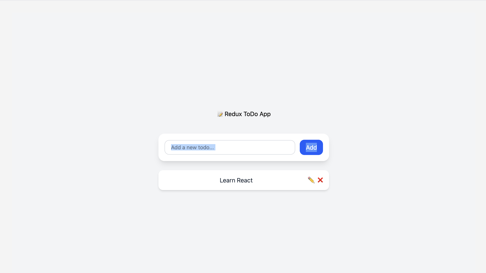

# 🧾 Redux Todo App

A minimal React + Redux Toolkit Todo application with TailwindCSS styling.

This project demonstrates:
- Adding, editing, removing todos using Redux Toolkit
- Usage of `createSlice`, `configureStore`, `useSelector`, and `useDispatch`
- Clean and responsive UI with TailwindCSS


---

## 🧠 Features

- ✅ Add todos
- 📝 Edit todos inline
- ❌ Delete todos
- 🎨 TailwindCSS-styled components
- 🧰 Modular Redux logic

---

## 🏗️ Folder Structure

```
src/
|── app/  
|  └── store.js                     # Redux store configuration
├── features/
│   └── todos/
        └── todoSlice.js        # Redux slice, actions, reducer for todos
├── components/                 # UI components (AddTodo, TodoList)
       └── AddTodo.jsx
       └── TodoList.jsx       
└── App.js             # App entry point
```

---

## ⚙️ Getting Started

### 1. Clone the Repository

```bash
git clone https://github.com/mrtwinklebhardwaj/redux-todo-app.git
cd redux-todo-app
```

### 2. Install Dependencies

```bash
npm install
```

### 3. Start the App

```bash
npm run dev
```

Runs on [http://localhost:5174](http://localhost:5174)

---

## 🧾 Redux Logic Overview

- **State Location:** `features/todos/todoSlice.js`
- **Store Setup:** `app/store.js`
- **Redux Toolkit Used:** `createSlice`, `configureStore`
- **UI Communication:**
  - `useDispatch()` to send actions
  - `useSelector()` to access state

### Supported Actions:

| Action                | Description                     |
|------------------------|---------------------------------|
| `addTodo(text)`        | Add a new todo item             |
| `removeTodo(id)`       | Remove a todo item              |
| `enableEditTodo(id)`   | Enable inline editing mode      |
| `updateTodo({id, text})` | Save edited text               |
| `disableEditTodo(id)`  | Cancel editing mode             |

---

## 📦 Sample State Structure

```js
{
  todos: [
    {
      id: 1,
      text: "Learn Redux",
      enableEdit: false
    }
  ]
}
```

---

## 💡 Improvements (TODO)

- [ ] Add filters: All / Active / Completed
- [ ] Persist todos to localStorage
- [ ] Add drag-and-drop support
- [ ] Write tests using React Testing Library

---

## 📸 UI Preview

> _Add a screenshot here (optional)_


---

## 📄 License

MIT © 2025 YourName

---

## 🤝 Contributing

Pull requests are welcome. For major changes, please open an issue first to discuss what you’d like to change.

---

## 🛠 Built With

- [React](https://reactjs.org/)
- [Redux Toolkit](https://redux-toolkit.js.org/)
- [Tailwind CSS](https://tailwindcss.com/)
